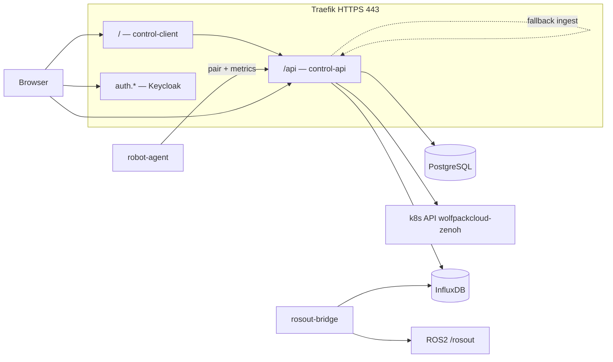

# WolfpackCloud-control

Панель управления кластером WolfpackCloud: **Vue 3 SPA**, **Control API (FastAPI)**, **PostgreSQL**, **Keycloak (OIDC)**, оркестрация workloads в namespace **`wolfpackcloud-zenoh`** на нодах пула **`wolfpack.io/role`** (**`worker`** и **`dev`** на одном уровне). Ноды **master/control-plane** в UI не показываются (настройки API — [`env.vars.reference`](env.vars.reference)).

Часть монорепозитория [WolfpackCloud-kubernetes](../): общий registry, BuildKit и Zenoh/peers — в `deploy/k3s/` на уровне родительского репозитория.

## Состав репозитория

| Каталог | Назначение |
|---------|------------|
| [`client/`](client/) | SPA (Vue 3, Vite, Keycloak JS, Pinia) |
| [`server/api/`](server/api/) | Control API, Alembic, pytest — [server/api/README.md](server/api/README.md) |
| [`rosout-bridge/`](rosout-bridge/) | ROS 2 → InfluxDB (Line Protocol), ingest-токен с API |
| [`robot-agent/`](robot-agent/) | Демо-робот: pairing + Telegraf heartbeat |
| [`deploy/k8s/`](deploy/k8s/) | Манифесты k3s: control, keycloak, influxdb, rosout-bridge, staging, robot-agent |
| [`loadtests/`](loadtests/) | k6, Zenoh peer hammer, staging/prod guard |
| [`e2e/`](e2e/) | Browser smoke (Selenium) |
| [`scripts/`](scripts/) | Keycloak seed staging, pytest на Postgres staging |

## Архитектура (production)



- **Аутентификация:** Keycloak realm `wolfpack-control`, клиент `wolfpack-control-web` (PKCE в SPA и Swagger).
- **Оркестрация:** API читает/патчит поды и деплойменты в `wolfpackcloud-zenoh`; drag-and-drop в UI — роль realm **`admin`**.
- **Логи ROS:** основной путь — **rosout-bridge → InfluxDB** (`ros_logs`); `GET /api/logs` читает Influx; `POST /api/internal/rosout/*` — fallback с `X-Ingest-Token`.
- **Роботы:** регистрация `POST /api/pair`, подтверждение в UI, heartbeat `POST /api/metrics`.

## Где работает production-сайт

**Всё в кластере k3s:** статический UI и API — поды в **`wolfpackcloud-control`**, Keycloak — в **`wolfpackcloud-auth`**, Ingress через **Traefik** на **HTTPS 443**. Локально не нужно «гонять» прод: достаточно собрать образы скриптом BuildKit и применить манифесты. Локальный [`docker-compose.dev.yml`](docker-compose.dev.yml) — опционально для разработки API/клиента без полного кластера (Keycloak — port-forward или внешний стенд).

## URL (production)

| Компонент | URL |
|-----------|-----|
| UI + API | `https://wolfpack.robotics-rtuitlab.ru` — `/` UI, `/api` backend |
| OpenAPI / Swagger UI | `https://wolfpack.robotics-rtuitlab.ru/api/docs` (JSON: `/api/openapi.json`, ReDoc: `/api/redoc`) |
| Keycloak | `https://auth.wolfpack.robotics-rtuitlab.ru` |
| Staging API | port-forward `http://127.0.0.1:18081/api` (см. [deploy/k8s/staging/README.md](deploy/k8s/staging/README.md)) |

В Swagger UI: **Authorize** → **KeycloakOIDC** — вход через Keycloak (authorization code + PKCE; клиент по умолчанию `wolfpack-control-web`, см. `KEYCLOAK_SWAGGER_CLIENT_ID` в [`env.vars.reference`](env.vars.reference)). Redirect: `{origin}/api/docs/oauth2-redirect`. Если realm уже создан без нужных redirect URIs — добавьте их в Keycloak ([wolfpack-control-realm.json](deploy/k8s/keycloak/wolfpack-control-realm.json)).

**DNS:** A/CNAME на основной хост и **`auth.wolfpack.robotics-rtuitlab.ru`**. Достаточно firewall **TCP 443**. Отдельный порт **4443** для Keycloak больше не используется (опциональный Traefik entrypoint: [deploy/k8s/traefik-entrypoint-4443/](deploy/k8s/traefik-entrypoint-4443/)).

## UI (маршруты SPA)

| Путь | Страница |
|------|----------|
| `/login` | Вход через Keycloak |
| `/dashboard` | Сводка |
| `/robots`, `/robots/:id` | Список и карточка робота |
| `/pairing` | Подтверждение привязки по коду |
| `/orchestration` | Ресурсы кластера, drag-and-drop подов |
| `/journal` | ROS-логи (Influx) |
| `/account` | Профиль / ссылка на Keycloak Account Console |

Подробнее — [client/README.md](client/README.md).

## API (группы маршрутов)

| Префикс | Назначение |
|---------|------------|
| `/api/auth` | Текущий пользователь (`/me`) |
| `/api/account` | Аккаунт, ссылка на Keycloak |
| `/api/robots` | CRUD роботов |
| `/api/pair` | Pairing (код, подтверждение) |
| `/api/metrics` | Heartbeat от агента (Telegraf) |
| `/api/networks` | ROS-сети пользователя |
| `/api/cluster` | Ноды, поды, оркестрация, compute presets |
| `/api/workloads` | Управляемые workloads |
| `/api/logs` | Чтение ROS-логов из Influx, статус pipeline |
| `/api/events` | События деплоя (Influx) |
| `/api/internal` | Ingest rosout (токен), служебное |
| `/health` | Healthcheck (БД, Influx) |

Схема и интерактивные вызовы — Swagger по URL выше.

## Быстрый старт (разработка)

```bash
# Postgres + API (порт 9200 по умолчанию)
docker compose -f docker-compose.dev.yml up -d --build postgres api

# Миграции (в контейнере api или локально с тем же DATABASE_URL)
docker compose -f docker-compose.dev.yml exec api alembic upgrade head

# Keycloak: port-forward из кластера или свой стенд; задайте KEYCLOAK_ISSUER / KEYCLOAK_JWKS_URL для api
# При необходимости смонтируйте kubeconfig в сервис api (compose override) для /api/cluster/*

cd client && npm ci && npm run dev
# Vite: http://localhost:5173; API — VITE_API_BASE_URL (см. compose CLIENT_PORT / API_PORT)
```

Переменные для клиента при dev: `VITE_KEYCLOAK_URL`, `VITE_KEYCLOAK_REALM`, `VITE_KEYCLOAK_CLIENT_ID`, `VITE_API_BASE_URL` (см. [`docker-compose.dev.yml`](docker-compose.dev.yml)).

## Деплой в k3s

### Сборка образов в cluster registry (BuildKit)

Из **корня монорепозитория** WolfpackCloud-kubernetes — [`scripts/build-with-buildkit.sh`](../scripts/build-with-buildkit.sh) (BuildKit в `wolfpackcloud-build`, push в **`10.43.50.10:5000`**).

```bash
REG=10.43.50.10:5000
TAG=latest

build_client_opts=(
  --opt build-arg:VITE_API_URL=/api
  --opt build-arg:VITE_API_BASE_URL=https://wolfpack.robotics-rtuitlab.ru/api
  --opt build-arg:VITE_KEYCLOAK_URL=https://auth.wolfpack.robotics-rtuitlab.ru
  --opt build-arg:VITE_KEYCLOAK_REALM=wolfpack-control
  --opt build-arg:VITE_KEYCLOAK_CLIENT_ID=wolfpack-control-web
)

ARCH=arm64
S="${TAG}-${ARCH}"
./scripts/build-with-buildkit.sh "$ARCH" WolfpackCloud-control/server/api \
  "${REG}/wolfpack-control-api:${S}" --opt target=production
./scripts/build-with-buildkit.sh "$ARCH" WolfpackCloud-control/client \
  "${REG}/wolfpack-control-client:${S}" "${build_client_opts[@]}"
./scripts/build-with-buildkit.sh "$ARCH" WolfpackCloud-control/rosout-bridge \
  "${REG}/wolfpack-rosout-bridge:${S}"
./scripts/build-with-buildkit.sh "$ARCH" WolfpackCloud-control/robot-agent \
  "${REG}/wolfpack-control-robot-agent:${S}"
```

Для **amd64**: `ARCH=amd64`, тег `:latest-amd64`, поправьте affinity на `kubernetes.io/arch` в YAML.

При **RollingUpdate** на короткое время может быть два пода на разных нодах. У **control-api** и **control-client** включён **`Recreate`** и тег **`:latest-arm64`**, чтобы не смешивать архитектуры.

### Порядок apply (production)

1. **DNS** для `auth.wolfpack…` → тот же LB/VPS, что и основной сайт.
2. **Keycloak** — см. [Keycloak: чистый деплой](#keycloak-clean-deploy). `keycloak-secrets.yaml` → `kubectl apply -k deploy/k8s/keycloak/` → **`wolfpackcloud-auth`**.
3. Если realm **уже импортирован**, `IGNORE_EXISTING` не обновит клиента: в Admin → **wolfpack-control** → **wolfpack-control-web** проверьте **Web origins** (`https://wolfpack…` и `https://auth.wolfpack…`, без `:4443`).
4. **Роли:** realm/client role **`admin`**; либо **`CONTROL_ADMIN_USERNAMES`** в Secret API.
5. **Control:** `control-infra-secrets.yaml`, `api-secret.yaml` → `kubectl apply -k deploy/k8s/control/` → **`wolfpackcloud-control`**.
6. **InfluxDB** — [deploy/k8s/influxdb/README.md](deploy/k8s/influxdb/README.md); тот же `INFLUXDB_TOKEN` в `control-api-env`.
7. **Rosout-bridge:** Secret в **`wolfpackcloud-zenoh`**, `kubectl apply -k deploy/k8s/rosout-bridge/`.
8. Миграция **`004`** (drop `ros_log_entries`): `kubectl exec -n wolfpackcloud-control deploy/control-api -- alembic upgrade head`.
9. **robot-agent** (опционально) — [deploy/k8s/robot-agent/README.md](deploy/k8s/robot-agent/README.md).

<a id="keycloak-clean-deploy"></a>

### Keycloak: чистый деплой и первый пользователь

Импорт realm создаёт клиентов и роли, **но не учётки людей**.

```bash
cd WolfpackCloud-control
# cp deploy/k8s/keycloak/keycloak-secrets.example.yaml deploy/k8s/keycloak/keycloak-secrets.yaml
kubectl apply -f deploy/k8s/keycloak/keycloak-secrets.yaml
kubectl apply -k deploy/k8s/keycloak/
kubectl rollout status deployment/keycloak -n wolfpackcloud-auth --timeout=600s
```

1. Admin Console: `https://auth.wolfpack.robotics-rtuitlab.ru/admin` — bootstrap **`admin`** / пароль из **`keycloak-admin-secret`** (master realm, не пользователь приложения).
2. Realm **`wolfpack-control`** → **Users** → создать пользователя, **Email verified**, пароль без **Temporary**.
3. **Role mapping:** **`user`**; для оркестрации — **`admin`**.
4. Вход в UI/Swagger — этот пользователь realm (PKCE или password grant для k6).

**Полный сброс:** удалить namespace **`wolfpackcloud-auth`**, применить секреты и kustomize снова.

## Тестирование и нагрузка

| Тип | Документация |
|-----|----------------|
| Юнит/интеграция API (SQLite / staging Postgres) | [server/api/tests/README.md](server/api/tests/README.md) |
| k6, полный цикл Zenoh+HTTP | [loadtests/README.md](loadtests/README.md) |
| Staging namespace + loadtest users | [deploy/k8s/staging/README.md](deploy/k8s/staging/README.md) |
| Browser E2E | [e2e/README.md](e2e/README.md) |

**Staging (рекомендуется для k6/e2e):** `loadtests/run-load-staging.sh`, realm `wolfpack-control-staging`, Secret `loadtest-credentials`.

**Production load:** только с `ALLOW_PROD_LOADTEST=1` (см. `loadtests/guard-prod-loadtest.sh`).

## Smoke-test

1. UI → редирект на **auth.** → вход.
2. `curl -sS -H "Authorization: Bearer $ACCESS_TOKEN" https://wolfpack.robotics-rtuitlab.ru/api/cluster/orchestration`
3. «Ресурсы кластера» — перетаскивание workload (роль **`admin`**).
4. Ingest: `curl -sS -o /dev/null -w "%{http_code}" -X POST …/api/internal/rosout/one -H "X-Ingest-Token: $ROSOUT_INGEST_TOKEN" -d '{"message":"smoke","level":"20"}'` → **204**.
5. Логи робота / **Журнал** — `GET /api/logs`; статус — `GET /api/logs/status`.

## Переменные и секреты

В **k3s** не коммитить заполненные секреты — копии из `*.example.yaml` в `deploy/k8s/*/`. Список в [.gitignore](.gitignore). Справочник: [env.vars.reference](env.vars.reference).

## Лицензия

См. [LICENSE](LICENSE).
